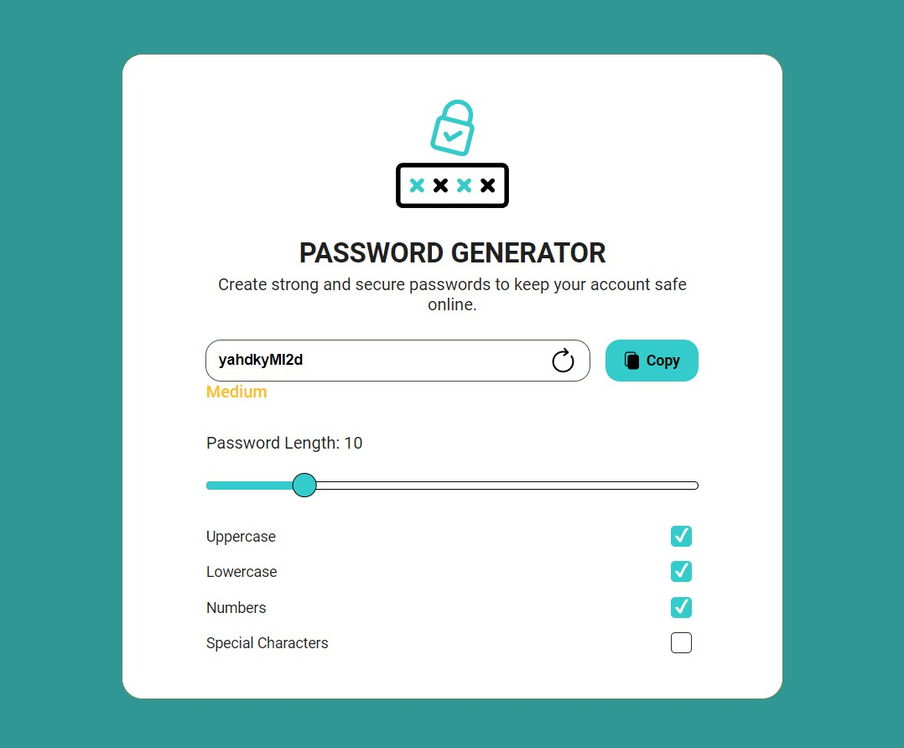

# Primeiros passos com o aplicativo Generate-Password

Este projeto foi inicializado com [Create React App](https://github.com/facebook/create-react-app).

## Scripts Disponíveis

No diretório do projeto, você pode executar:

### `npm start`

Aplicativo gerador de senhas aleatórias para o usuário (senhas fáceis, medias ou dificeis), é possivel definir também o limite de caracteres!
